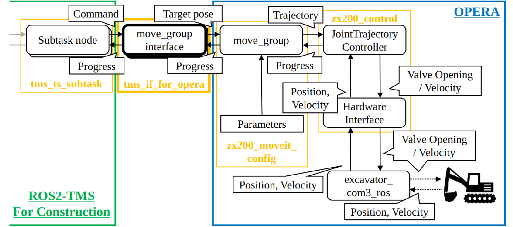
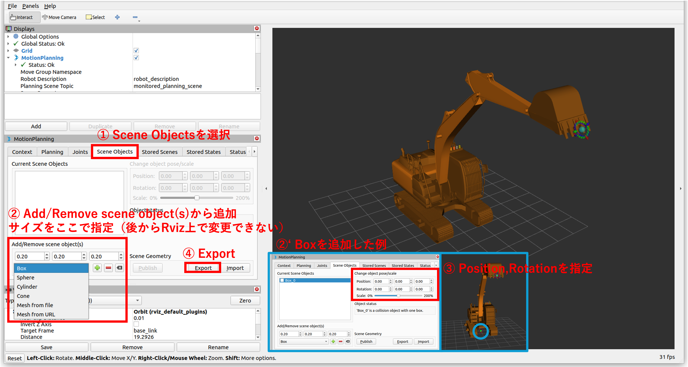
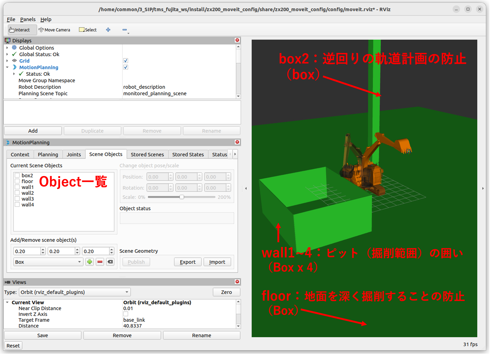

# TMS-I/F-For-OPERA

The tms_if_for_opera module serves as an interface that mediates the connection between the ROS2-TMS for Construction developed by us and the OPERA developed by PWRI. 
The following figure is the overall architecture.





As shown in the figure above, the tms_if_for_opera is an interface module used to connect ROS2-TMS for Construction and OPERA. It operates the OPERA-compatible construction machinery based on the operation instructions sent from the task management system of ROS2-TMS for Construction.

Currently, the tms_if_for_opera module is implemented only with the functionality to interface with the OPERA-compatible construction machine ZX200, and the operational overview is depicted in the figure above.
The operation will be explained below.


1. First, the task management system of ROS2-TMS for Construction executes sub-tasks according to the task sequence. Then, based on its implementation, the sub-task sends data required for motion planning, such as target position and orientation for the desired joint (e.g., end effector) of the OPERA-compatible construction machinery, to tms_if_for_opera using MoveIt!.
2. When tms_if_for_opera receives these values from the Subtask Node executed by the task management system of ROS2 TMS for Construction, it forwards those values to move_group, which is part of OPERA.
3. Upon receiving the values, the move_group module performs motion planning using MoveIt!, and the planned motion plan is then sent to modules referred to as JointTrajectoryController or HardwareInterface.
4. Then, the JointTrajectoryController or HardwareInterface calculates values such as valve openings to be sent to the actual construction machinery, based on the received motion plan, to faithfully execute these commands on the OPERA-compatible construction machinery in real life. These calculated values are sent to the excavator_com3_ros module.
5. Up to this point, the communication flow from Subtask Node → move_group_interface → move_group → JointTrajectoryController → HardwareInterface → excavator_com3_ros has all been conducted using ROS2 Actions and based on the ROS2 format. However, when it comes to actually operating the construction machinery, it's necessary to convert the ROS2 communication into CAN signals. This function is handled by excavator_com3_ros.
6. The CAN signals calculated by the excavator_com3_ros module are then sent to the actual OPERA-compatible construction machinery, initiating operation. Furthermore, state signals included in the current status of each joint are sent from the OPERA-compatible construction machinery back to excavator_com3_ros as CAN signals.
6. Then, excavator_com3_ros converts the received CAN signals into ROS2 format and returns the values in reverse order from earlier: excavator_com3_ros → HardwareInterface → JointTrajectoryController → move_group → tms_if_for_opera → Subtask Node.
7. And then, the Subtask Node transmits these signals, which indicate the current state of OPERA, to the task management system of ROS2-TMS for Construction. By doing so, the task management systenm of ROS2-TMS for Construction is able to operate while verifying the current state of the OPERA-compatible construction machinery.


Thus, tms_if_for_opera is an indispensable module for operating OPERA-compatible construction machinery from the task management system of ROS2-TMS for Construction. In the future, we plan to add interface functionalities to the tms_if_for_opera module for OPERA-compatible construction machinery, including not only the backhoe ZX200 but also crawler dumps such as the IC120 and other OPERA-compatible construction machinery.

## 軌道計画
　[OPERA](https://github.com/pwri-opera)の[zx200_ros2](https://github.com/pwri-opera/zx200_ros2)を使用した場合の軌道計画の一例を説明する。

### 事前準備
　[ros2_tms_for_construction(Setupセクション)](https://github.com/irvs/ros2_tms_for_construction#Setup)を行う。

### 障害物設定の方法
　[Moveit2(PlanningAroundObjects)](https://moveit.picknik.ai/main/doc/tutorials/planning_around_objects/planning_around_objects.html)を利用した軌道計画は、[PlanningScene](https://moveit.picknik.ai/humble/doc/examples/planning_scene/planning_scene_tutorial.html)を利用して行われる。
そのPlanningSceneに障害物を追加する方法は2つあり、それに伴い、tms_if_for_operaで障害物を設定する方法としても2つあるため、それぞれ紹介する。

1. Rviz2上から追加
    1. 軌道計画時のRviz2を起動
        ```bash
        cd ~/ros2-tms-for-construction_ws && source install/setup.bash
        ros2 launch zx200_unity zx200_standby.launch.py
        ```
    2. 画像中の手順に従い、障害物を設定後、エクスポート
        

        例：ピット内の土山を掘ることを想定した場合の障害物設定
        

    3. データベースに登録
        
        2.の例における出力ファイルは以下のようになる。
        出力される各パラメータ中で必要となるものは、*の印のある部分がObject名、そこからPosition(x,y,z)、Rotation(qx,qy,qz,qw)と続き、1行飛ばして、Object形状種類、Objectサイズである。
        ```txt
        # Example.scene
        (noname)+
        * box2
        -4 4 8
        0 0 0 1
        1
        box
        1 1 16
        0 0 0
        0 0 0 1
        0 0 0 0
        0
        * floor
        0 0 -2
        0 0 0 1
        1
        box
        100 100 0.001
        0 0 0
        0 0 0 1
        0 0 0 0
        0
        * wall1
        -4.795 -6.244 0
        0 0 0 1
        1
        box
        0.05 8 4
        0 0 0
        0 0 0 1
        0 0 0 0
        0
        * wall2
        0.205 -10.244 0
        0 0 0.707107 0.707107
        1
        box
        0.05 10 4
        0 0 0
        0 0 0 1
        0 0 0 0
        0
        * wall3
        0.205 -2.225 0
        0 0 0.707107 0.707107
        1
        box
        0.05 10 4
        0 0 0
        0 0 0 1
        0 0 0 0
        0
        * wall4
        5.205 -6.244 0
        0 0 0 1
        1
        box
        0.05 8 4
        0 0 0
        0 0 0 1
        0 0 0 0
        0
        .
        ```
        これを以下のようなjson形式でMongoDB中のparameterコレクションに登録する。
        primitive_type:1 -> Box
        ```json
        {
        "model_name": "zx200",
        "type": "static",
        "description": "Collision objects for demo 2024/02/22~.",
        "collision_objects": [
            {
            "id": "floor",
            "frame_id": "",
            "primitive_type": 1,
            "dimensions": [
                100,
                100,
                0.001
            ],
            "pose": {
                "position": {
                "x": 0,
                "y": 0,
                "z": -2
                },
                "orientation": {
                "x": 0,
                "y": 0,
                "z": 0,
                "w": 1
                }
            }
            },
            {
            "id": "wall1",
            "frame_id": "",
            "primitive_type": 1,
            "dimensions": [
                0.05,
                8,
                4
            ],
            "pose": {
                "position": {
                "x": -4.795,
                "y": -6.244,
                "z": 0
                },
                "orientation": {
                "x": 0,
                "y": 0,
                "z": 0,
                "w": 1
                }
            }
            },
            {
            "id": "wall2",
            "frame_id": "",
            "primitive_type": 1,
            "dimensions": [
                0.05,
                10,
                4
            ],
            "pose": {
                "position": {
                "x": 0.205,
                "y": -10.244,
                "z": 0
                },
                "orientation": {
                "x": 0,
                "y": 0,
                "z": 0.7071,
                "w": 0.7071
                }
            }
            },
            {
            "id": "wall3",
            "frame_id": "",
            "primitive_type": 1,
            "dimensions": [
                0.05,
                10,
                4
            ],
            "pose": {
                "position": {
                "x": 0.205,
                "y": -2.225,
                "z": 0
                },
                "orientation": {
                "x": 0,
                "y": 0,
                "z": 0.7071,
                "w": 0.7071
                }
            }
            },
            {
            "id": "wall4",
            "frame_id": "",
            "primitive_type": 1,
            "dimensions": [
                0.05,
                8,
                4
            ],
            "pose": {
                "position": {
                "x": 5.205,
                "y": -6.244,
                "z": 0
                },
                "orientation": {
                "x": 0,
                "y": 0,
                "z": 0,
                "w": 1
                }
            }
            },
            {
            "id": "box2",
            "frame_id": "",
            "primitive_type": 1,
            "dimensions": [
                1,
                1,
                16
            ],
            "pose": {
                "position": {
                "x": -4,
                "y": 4,
                "z": 8
                },
                "orientation": {
                "x": 0,
                "y": 0,
                "z": 0,
                "w": 1
                }
            }
            }
        ],
        "record_name": "collision_objects"
        }
        ```
2. meshモデル(.dae)から追加
    1. meshモデルをMongoDB中のparameterコレクションに登録

        それぞれのターミナルで以下のコマンドを実行
        ```bash
        # 1つ目のターミナル
        cd ~/ros2-tms-for-construction_ws && source install/setup.bash
        ros2 run tms_db_manager tms_db_writer_collision
        ```
        ここで、model_nameは軌道計画を行うバックホウの名前(ここではzx200)、filepathは絶対パスで指定すると良い。
        ```bash
        # 2つ目のターミナル
        cd ~/ros2-tms-for-construction_ws && source install/setup.bash
        ros2 topic pub /tms_db_collision tms_msg_db/msg/TmsdbCollision "{ model_name: 'zx200', type: 'dynamic', filepath: '/path/to/meshfile(.dae)'}"
        ```
        
### 追加した障害物を考慮した軌道計画

以下のコマンドでtms_if_for_operaを立ち上げ、通常通り、[OPERA](https://github.com/pwri-opera)の[zx200_ros2](https://github.com/pwri-opera/zx200_ros2)と[ros2_tms_for_construction](https://github.com/irvs/ros2_tms_for_construction)を利用したタスクの実行を行う。

ここで、collision_object_record_nameにはRviz2上から障害物を追加してMongoDBに格納した場合のrecord_name、collision_object_dump_record_nameにはmeshモデルから追加したMongoDBに格納した場合のrecord_nameを指定する。
どちらか一方、もしくはどちらも指定しない場合は障害物は考慮されない。

```bash
cd ~/ros2-tms-for-construction_ws && source install/setup.bash
ros2 launch tms_if_for_opera tms_if_for_opera.launch.py collision_object_record_name:='collision_objects' collision_object_dump_record_name:='collision_object_ic120'
```

例：追加した障害物を考慮した軌道計画を試すためのコマンド（上記のコマンドの実行の他に必要な部分を補足）

```bash
# 1つ目のターミナル
cd ~/ros2-tms-for-construction_ws && source install/setup.bash
ros2 launch zx200_unity zx200_standby.launch.py 
```
```bash
# 2つ目のターミナル
cd ~/ros2-tms-for-construction_ws && source install/setup.bash
ros2 launch tms_ts_launch tms_ts_construction.launch.py task_id:=<task_id>
```
※<task_id>は、zx200を使用するタスクのidを指定する。
    

